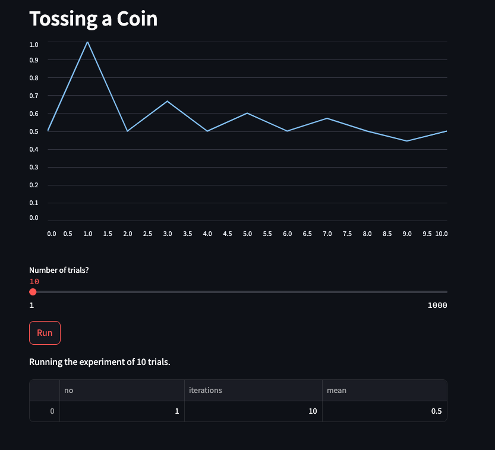

# 🪙 Coin Toss Simulation App
A simple Streamlit web app that simulates tossing a coin. Built as a hands-on project to practice deploying Python-based applications on Render. Includes basic setup with Streamlit, custom configuration, and visualization tools using Plotly and Altair.
This is a simple interactive web app that simulates tossing a coin. You can adjust the number of trials using a slider, and the app displays the result of your experiment.

## 🖥️ Features
- Adjustable trials from 1 to 1000
- Simulates random coin tosses
- Displays output based on selected number of trials
- Built using Python, Streamlit, and Render

## 📸 Screenshot

## 🚀 Live Demo
👉 [Try the live app here]([https://your-app-name.onrender.com](https://coin-toss-app-1-ugyz.onrender.com)

## 📁 Tech Stack
- Python
- Streamlit
- Git / GitHub
- Render for deployment

## 🛠️ Status
🚧 This app is currently under construction and not fully functional.
